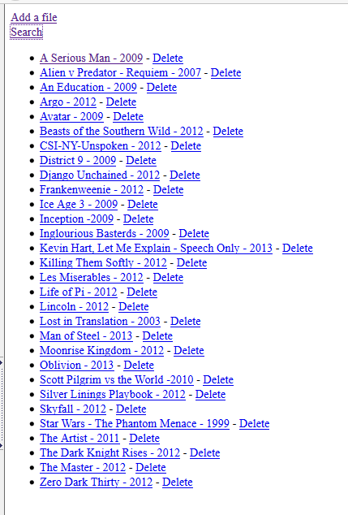
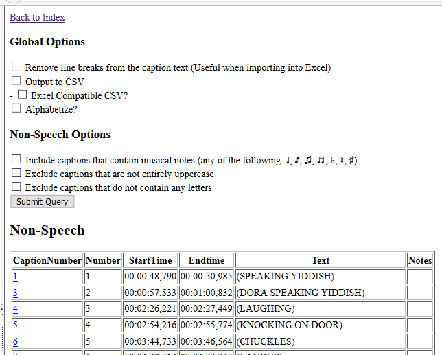
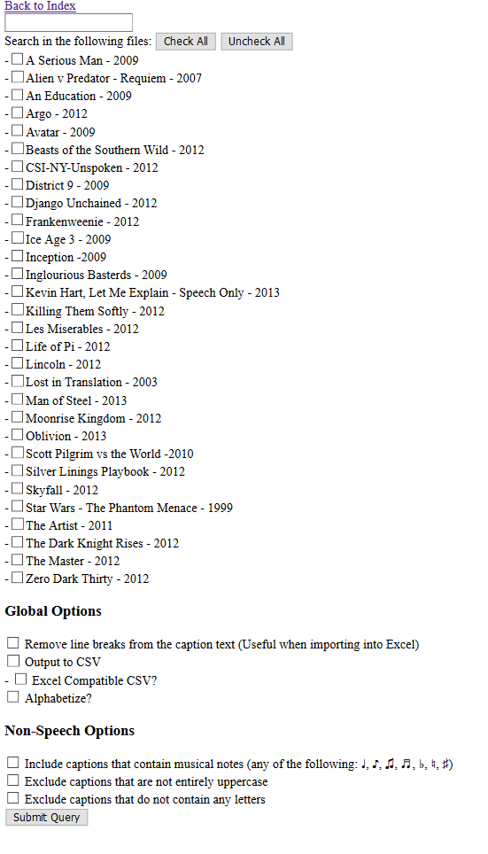
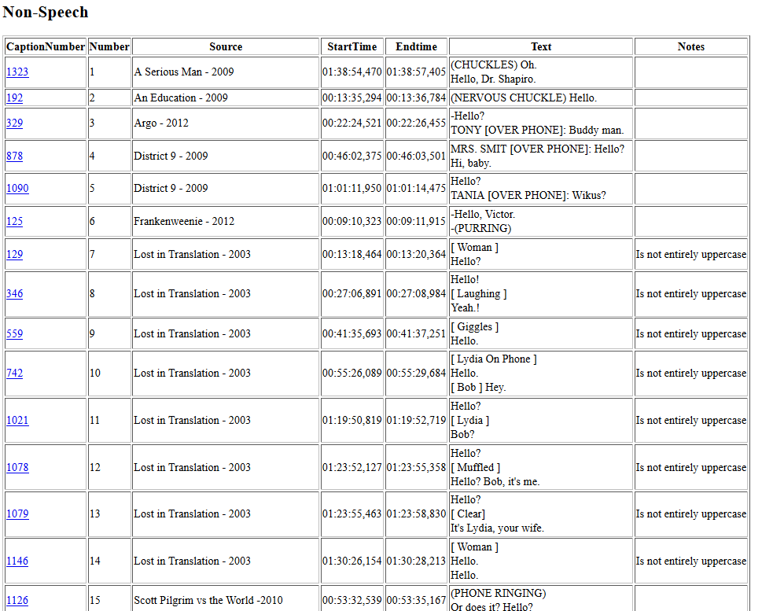

NSI
===

NSI is an acronym for Non-Speech Information, a generic term for any information conveyed by captions that isn't a pure transcription. This is an application that stores caption files (`.SRT`), and makes it easier to search through those files for NSI. The primary uses of this application are to find Non-Speech (`(ALARM RINGING)`), to find Speaker IDs (`TOM: hello world`), and to find musical notes, but full text search is supported as well.

This tool was written for my father's use during his research for his book, [Reading Sounds](https://www.amazon.com/Reading-Sounds-Closed-Captioned-Popular-Culture/dp/022631278X/)

This tool is not very fast, and would be unbearably slow with more than ~100 files. It has a "database" -- literally a folder with SRT files in it. It's not secure, and it's hastily written. That said, it works OK.

Compiled releases can be found [here](https://github.com/liamzdenek/NSI/releases). The executables must be launched from a command line, and won't work via double-clicking. (`cmd.exe`/`terminal.app`)

imgs
----

Index page shows a list of caption files

Clicking on one file shows a page to search in just that one file

Clicking on the search button at the top lets you select potentially many files.

The results from a search are split into 3 categories. Non-Speech, Speaker IDs, and Other.

